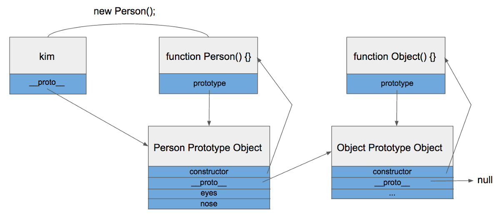

## Why

The concepts of **Object-oriented programming** have shaped the design of many programming languages, including JavaScript. Object-oriented programming aims at breaking a program into smaller pieces that interact with each other to perform tasks.

In object-oriented programming, different code blocks in your program interact with each other through **interfaces**. Interfaces are snippets of code that provide useful functionality at a more abstract level, keeping the bulk of the object hidden (especially parts of the object that I as a collaborator do not need to see or access when I interact with the object).

We have interacted with some of these interfaces already (i.e. `array.length`, `array.map()`, `Math.round()`, `Date.getTime()`). But you can create your own predefined objects as well.

## What

### Review

We’ve already learned that we can create an object:

```js
let obj = {
  someProp: "value",
  someMethod: function () {
    return this.someProp;
  },
};
```

To review, objects have properties that can be any value. Properties that are assigned function values are referred to as **methods**.

When you call methods on an object, you can access other object properties using the `this` keyword. Above we defined a function value to the `obj` property `someMethod`. Declaring functions with the `function` keyword allows you to access it’s own binding value, whose value depends on the invocation context.

We succeed in using the `this` keyword above because it refers to the object from which it was called.

### Prototypes

A **prototype** is another object, a base object, that is used as a fallback with predefined properties and methods that all of our objects can inherit.

Object.prototype &lt;= Math.prototype, Object.prototype &lt;= Array.prototype, etc

The base object in JavaScript is the **Object prototype**. All objects that are based from the Object prototype share it’s properties and methods. You can override these properties or methods by defining them on a prototype object.



You use **Object.create** to create an object with a specific prototype:

```js
let city = {
  name: null,
  state: null,
  lat: null,
  long: null,
};

let hoover = Object.create(city);
hoover.name = "Hoover";
hoover.state = "Alabama";
```

You can also use a **Function constructor** to instantiate objects from a prototype:

```js
function City(name, state, lat, long) {
  this.name = name;
  this.state = state;
  this.lat = lat;
  this.long = long;
}

let hoover = new City("Hoover", "Alabama");
```

### Classes

JavaScript prototypes are loose similar to the object-oriented programming concept of **classes**.

You can think of classes as **models of objects, with properties and methods**. Classes are just _syntax sugar_ for working with prototypes in JavaScript.

Objects created from a specific class are called **instances**.

```js
class City {
  constructor(name, state, lat, long) {
    this.name = name;
    this.state = state;
    this.lat = lat;
    this.long = long;
  }
}
```

## How

You can create a prototype for objects in your program with `Object.create(prototype)`, **function constructors**, or **class syntax**. Any instantiated object has access to its prototype's properties and methods.

### Class Notation

Since 2015, classes now have their own JavaScript notation common to other object-oriented programming languages. Now you can use the `class` and `constructor` keywords instead of the two pre-class syntax methods.

```js
class Person {
  constructor(name) {
    this.name = name;
  }

  speak() {
    console.log(`Hello! My name is ${this.name}.`);
  }
}

let frodo = new Person("Frodo");
```

Use the `new` keyword before a function to signify calling the class constructor. It is best practice to capitalize the names of classes to differentiate constructors from normal functions in your program (`new Person()` above^).

### Pillars of Object-Oriented Programming in JavaScript (Briefly)

**Abstraction** is the concept of using ‘actions over values’. This allows you to step back from the minute details and design with a larger view/focus.

**Encapsulation** only uses parts of objects used in an interface. The properties and methods accessible from an object are public (available via the interface). All other details are private (hidden).

**Polymorphism** allows other types of objects to use an interface. This allows for any kind of object that uses an interface to use a method (think accessing properties and methods). For example, the `Object.prototype` has a `toString()` method that returns a string representation of the object. (`[1, 2, 3, 4, 5].toString() // would result in "1,2,3,4,5"`)

**Inheritance** defines a subclass with access to superclass properties and methods. This concept explains how each prototype points back to the **Object.prototype**. The **Array.prototype** inherits properties and methods from the **Object. Prototype**. Thus, we can access the **Object. prototype.toString()** method with an array.

```js
class Coder extends Person {
  constructor(name, skillset) {
    super(name);

    this.skillset = skillset;
  }

  speak() {
    console.log(`Hello! My name is ${this.name} and I'm a coder!`);
  }
}
```

Here we created a class `Coder` that **inherits** from our `Person` class from earlier. Key things to notice when creating a class that inherits from a superclass:

- `extends` keyword after the class name, followed by the parent class
- `super` inside the `Coders`’ constructor method. The `super` method refers to the parent class’ constructor method
- We redefined the `speak()` method. This is referred to as **method overriding**

## Takeaways

1. JavaScript is Object-Oriented at its core, with _prototypes_
2. Prototypes are _models_, or blueprints, for every object we create and use in JS
3. A prototype can have predefined properties and methods that can be inherited to _instances_ created from that prototype
