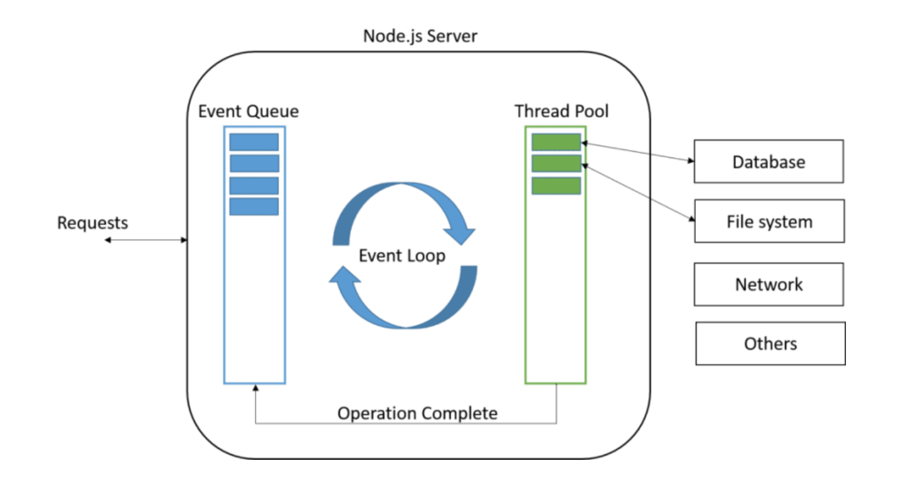

## Why

**NodeJS** (or just ‘Node’) has been steadily gaining popularity since its creation in 2009. There is a plethora of support surrounding Node, knowledge of it is a prerequisite for any front-end development work that relies on 3rd party packages, and it is an in-demand skillset to have in the growing industry.

## What

### What is Node?

> _“As an asynchronous event driven JavaScript runtime, Node is designed to build scalable network applications.”_

This is a definition that requires a little unpacking.

The important bit to understand right up front is that Node is a “JavaScript runtime environment”. When JavaScript was first created, it was designed to run _in the browser_. This means that it was impossible to use JavaScript to write any kind of program that was not a web-site. Node brings JavaScript _out_ of the browser. This allows developers to use JavaScript to accomplish pretty much anything that other popular server-side languages (such as Ruby, PHP, C# and Python) can do. So, at its most basic level, Node simply allows you to run JavaScript code on a machine such as your local computer or a server without having to go through a web-browser.

To facilitate this, Node has some added functionality that is not found in browser-based JavaScript, such as the ability to read and write local files, create http connections and listen to network requests.

### Event Driven

Back to the definition from Node’s documentation: **Node is an asynchronous event driven JavaScript runtime**. In this context asynchronous means that when you write your code you do not try to predict the exact sequence in which every line will run. Instead you write your code as a collection of smaller functions that get called in response to specific events such as a network request (event driven).

For example, let’s say you are writing a program and you need it to do the following. It should read some text from a file, print that text to the console, query a database for a list of users and filter the users based on their age.

Instead of telling your code to do those steps sequentially like so:

1. Read File
2. Print File Contents
3. Query Database
4. Filter Database Query results

You can break up the task like so:

1. Read File _AND THEN_ Print File Contents
2. Query Database _AND THEN_ Filter Database Query Results.
   When you run this program Node will start at the top and begin reading the file but since that is an action that takes some time it will immediately begin running the second step (querying the database) while it’s waiting on the file to finish reading.

While both of these processes are running, **Node sits and waits on an event**. In this case, it is waiting on the completion of both processes, the reading of a file and the database query. When either of these tasks are finished, Node will fire off an event that will run the next function we’ve defined. So if the read-file process finishes first, it will print the file contents. If the database query finishes first, it will start the filtering process. As the programmer, we don’t know or care which order the two processes are going to be completed. If this code was processed synchronously (rather than asynchronously) we would have to wait for each step in the program before moving on to the next one, which could cause things to slow down considerably. If the file that we needed to read was really long then we might have to wait a few seconds before the database query could begin.

This process is almost exactly like the way that you would use addEventListener in front-end JavaScript to wait for a user action such as a mouse-click or keyboard press. The main difference is that the events are going to be things such as network requests and database queries. This functionality is facilitated through the use of **callbacks**. Callbacks are incredibly important to Node.

### Event Loop

The event loop is an important concept to understand how Node really works. As we've mentioned, Node is an asynchronous, event driven runtime environment for executing JavaScript server-side. Node is also _single threaded_. Now, the key combination is asynchronous code and the single thread to remain non-blocking. As you initiate an asynchronous action, the event loop with cycle through ticks infinitely. As an asynchronous action completes, it will execute the pending callback in the next tick (or cycle). Node balances actions between an Event Queue and accessible thread pool for completing or waiting on I/O operations, both of which are tied together with the event loop.



## How

### Running JavaScript Files in Node

Node.js files must be initiated using a "Command Line Interface" program on your computer.

Up to this point, we’ve used our Command Prompt or Terminal quite a bit. To run JavaScript files server-side, we'll use the Node CLI in our terminals.

Navigate to any existing JavaScript file on your computer (one that does not contain code that uses the DOM API). In your terminal, run: `node <FILENAME>`, making sure that you replace the placeholder in that example with your real file name. If that file contains `console.log`'s, you'll see them in your terminal now!

You can also copy and paste the following code in a `.js` file, and run it to see a simple number guessing game through node.

```js

```

## Takeaways

1. Node.js is a **server-side runtime environment** built on Google Chrome's Javascript Engine (V8 Engine) which **compiles Javascript code into Machine code**.
2. Node.js uses an **event-driven, non-blocking I/O** model that makes it lightweight and efficient. It's not a Framework, it's not a Library, it's a **runtime environment**.
3. Node.js is **single-threaded**, which requires the **event loop** to handle asynchronous operations and pending callbacks to remain efficient and non-blocking.
